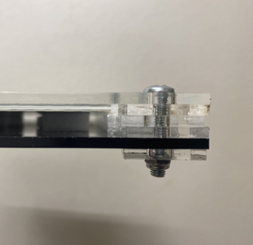

## Inhaltsverzeichnis

<!-- TOC -->
* [Vorbereitung](#vorbereitung)
  + [Material](#material)
  + [Werkzeug](#werkzeug)
  + [Software](#software)
  + [Empfohlene Vorkenntisse](#empfohlene-vorkenntisse)
* [Bauanleitung](#bauanleitung)
  + [Zuschneiden der Box](#zuschneiden-der-box)
  + [Zusammensetzen der Box](#zusammensetzen-der-box)
  + [Die Box füllen](#die-box-füllen)
  + [Das Display verpacken](#das-display-verpacken)
  + [Verkabelung](#verkabelung)
  + [Den Arduino programmieren](#den-arduino-programmieren)
  + [Alles zusammenbringen](#alles-zusammenbringen)
* [Funktionsweise](#funktionsweise)
* [Ausblick](#ausblick)
<!-- TOC -->

## Vorbereitung
Hast du es satt, jedes Mal den Kühlschrank zu öffnen, um nachzusehen, was du noch im Haus hast? Mit FridgeView von CreativeVision hast du immer einen Überblick über deine Vorräte, ohne den Kühlschrank zu öffnen. Die eingebaute Kamera projiziert das Innere des Kühlschranks auf ein E-Paper-Display an der Vorderseite, so dass du jederzeit weißt, was du hast und was du noch brauchst. Spare Zeit, Energie und vermeide unnötige Einkäufe mit FridgeView.  

Mit FridgeView bewusst Energie sparen - Unser Beitrag zur Lösung der Energie-Challenge 

Unser Ziel bei CreativeVision war es, Menschen dazu zu motivieren, ihren Energieverbrauch bewusst wahrzunehmen und aktiv Energie zu sparen. Wir haben 15 Wochen damit verbracht, dieses Ziel mit unserer Erfindung FridgeView zu erreichen. Durch die Anwendung von Design Thinking und der Umsetzung unserer Idee haben wir ein intelligentes Gerät geschaffen, das es den Benutzern ermöglicht, ihren Kühlschrankinhalt jederzeit auf einfache und bequeme Weise zu überblicken. Mit FridgeView können Menschen ihre Einkäufe und Vorräte besser planen und so ihren Energieverbrauch reduzieren. Unser Projekt war eine Zusammenarbeit von Studierenden unterschiedlicher Fakultäten und Studiengänge, die dazu beitragen sollte, die Bedeutung von Energiesparen zu vermitteln. 

POV: Ein kluger Blick auf den Energieverbrauch in Ihrem Kühlschrank. 
„Julia ist es leid, dass sie ihren Kühlschrank ständig öffnen muss, um nachzusehen, was sie noch hat. Sie weiß, dass dies nicht nur Zeit, sondern auch Energieverschwendung bedeutet. Sie wünscht sich eine Lösung, die ihr einen Einblick in den Inhalt ihres Kühlschranks gibt, ohne dass sie ihn ständig öffnen muss.“ 
### Material
- 1 x Arduino 

- 1 x ESP32 Cam 

- E-Paper-Display 

- Powerbank 

- Acrylglas 

- Button 

- Drahtbrückenkabel 

- Gummi 

- Saugknöpfe 

- Sekundenkleber 

- Flachbandkabel 

- LED-Ring 

- USB-Kabel 

### Werkzeug
- Bohrer 

- Lötkolben 

- Lasercutter 

### Software
- IDE Arduino  

- Inkspace 

### Empfohlene Vorkenntisse
- Zur Programmierung wird nur die Arduino interne Programmiersprache verwendet. (C) 

- Erfahrung mit Lasercutter 

- Erfahrung mit Lötkolben 

## Bauanleitung

### Zuschneiden der Box
Um eine robuste und feuchtigkeitsgeschützte Box für unsere Projektkomponenten zu schaffen, entschieden wir uns für Acrylglas als Material. Mit den Maßen 10cm x 5cm erfüllte es alle Anforderungen an Größe und Stabilität. Die Box wurde mithilfe der Seite https://www.festi.info/boxes.py/?language=de entworfen, wobei besonderes Augenmerk auf die Schaffung von Ausgängen für den Anschluss des ePapers (Wand 3) und der ESP32-Cam (Wand 1) lag. Die Stromversorgung wurde durch eine Power-Bank innerhalb der Box realisiert. Zu guter Letzt wurden die Löcher für den LED-Ring mit Hilfe des Standbohrers durchgeführt (Wand 1), dieser wurden anschließend in die Box eingefügt, um eine gute Beleuchtung für die Aufnahme der Bilder zu gewährleisten.  

### Zusammensetzen der Box

### Die Box füllen

### Das Display verpacken

Als Display wird ein E-Paper Display(Waveshare 7.5 Inch) benutzt. Um es außen am Kühlschrank zu befestigen wird ein Gehäuse aus Acrylglas [lasergecuttet](images/creative-visions/plattegroß.svg). Dabei wird dasselbe zweimal gecuttet, einmal durchsichtig für die Vorderseite, einmal in beliebiger Farbe für die Rückseite.
In die Vorderseite wird nun noch ein Loch zur befestigung des Knopfs zum Auslösen der Kamera gebohrt.
In die Rückseite wird nun noch ein Loch zur befestigung des Magneten gebohrt, dabei können je nach Saugnapf oder Magnet auch mehrere Löcher gebohrt werden.

Dann legt man zuerst die das Display mittig auf die durchsichtige Acryl-Platte. Danach kommt sehr weicher Schaumstoff (z.B. aus der Bildschirmverpackung) von hinten auf das Display. Als Letztes kommt die Acryl-Rückseite, mit dem Saugnapf darauf. Zusammengehalten wird das ganze von vier Schrauben mit Muttern in den Ecken. Beim Zusammenschrauben darauf achten, dass das Display und die Schraube om Saugnapf sich nicht berühren und im zweifelsfall die Acryl unterlegscheiben zwischen Vorder- und Rückseite mitverschrauben. Im Bild sind 3 solcher Unterlegscheiben zwischen und eine hintendran verwendet worden.

### Verkabelung

### Den Arduino programmieren

### Alles zusammenbringen

## Funktionsweise

## Ausblick
Mit unserem Projekt haben wir den Anspruch, die Art und Weise, wie wir unser tägliches Leben organisieren und gestalten, zu verbessern. In der Zukunft können wir uns vorstellen, dass unsere Lösung durch eine App-Integration noch kosteneffizienter und zugänglicher wird. Die Möglichkeit, bestehende Kühlschränke durch einfache Integration moderner zu gestalten, bedeutet, dass es keinen Bedarf an neuen Geräten gibt, sondern lediglich eine Modernisierung bestehender Kühlschränke. Dies trägt zu einer nachhaltigeren und umweltfreundlichen Zukunft bei. Wir glauben, dass unsere Lösung einen wertvollen Beitrag zur Optimierung unseres täglichen Lebens leisten kann, indem sie es einfacher und effizienter macht, Lebensmittel zu verwalten und zu planen. 
