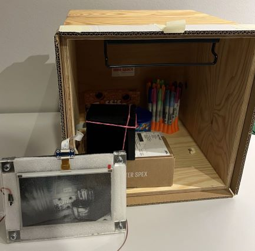
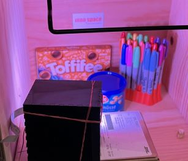
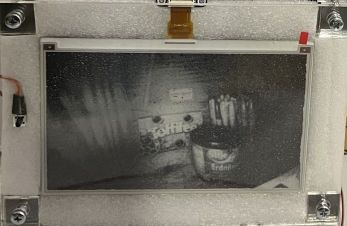

## Inhaltsverzeichnis

<!-- TOC -->
* [Vorbereitung](#vorbereitung)
  + [Material](#material)
  + [Werkzeug](#werkzeug)
  + [Software](#software)
  + [Empfohlene Vorkenntisse](#empfohlene-vorkenntisse)
* [Bauanleitung](#bauanleitung)
  + [Zuschneiden der Box](#zuschneiden-der-box)
  + [Das Display verpacken](#das-display-verpacken)
  + [Verkabelung](#verkabelung)
  + [Programmieren](#programmieren)
  + [Alles zusammenbringen](#alles-zusammenbringen)
* [Funktionsweise](#funktionsweise)
* [Ausblick](#ausblick)
<!-- TOC -->

Hast du es satt, jedes Mal den Kühlschrank zu öffnen, um nachzusehen, was du noch im Haus hast? Mit FridgeView von CreativeVision hast du immer einen Überblick über deine Vorräte, ohne den Kühlschrank zu öffnen. Die eingebaute Kamera projiziert das Innere des Kühlschranks auf ein E-Paper-Display an der Vorderseite, so dass du jederzeit weißt, was du hast und was du noch brauchst. Spare Zeit, Energie und vermeide unnötige Einkäufe mit FridgeView.  
 btest

Mit FridgeView bewusst Energie sparen - Unser Beitrag zur Lösung der Energie-Challenge 

Unser Ziel bei CreativeVision war es, Menschen dazu zu motivieren, ihren Energieverbrauch bewusst wahrzunehmen und aktiv Energie zu sparen. Wir haben 15 Wochen damit verbracht, dieses Ziel mit unserer Erfindung FridgeView zu erreichen. Durch die Anwendung von Design Thinking und der Umsetzung unserer Idee haben wir ein intelligentes Gerät geschaffen, das es den Benutzern ermöglicht, ihren Kühlschrankinhalt jederzeit auf einfache und bequeme Weise zu überblicken. Mit FridgeView können Menschen ihre Einkäufe und Vorräte besser planen und so ihren Energieverbrauch reduzieren. Unser Projekt war eine Zusammenarbeit von Studierenden unterschiedlicher Fakultäten und Studiengänge, die dazu beitragen sollte, die Bedeutung von Energiesparen zu vermitteln. 

POV: Ein kluger Blick auf den Energieverbrauch in Ihrem Kühlschrank. 
„Julia ist es leid, dass sie ihren Kühlschrank ständig öffnen muss, um nachzusehen, was sie noch hat. Sie weiß, dass dies nicht nur Zeit, sondern auch Energieverschwendung bedeutet. Sie wünscht sich eine Lösung, die ihr einen Einblick in den Inhalt ihres Kühlschranks gibt, ohne dass sie ihn ständig öffnen muss.“ 

## Vorbereitung

### Material
- 1 x Arduino 

- 1 x ESP32 Cam 

- FTDI programmer

- E-Paper-Display 

- Powerbank 

- Acrylglas 

- Button 

- Drahtbrückenkabel 

- Gummi 

- Saugknöpfe 

- Sekundenkleber 

- Flachbandkabel 

- LED-Ring 

- USB-Kabel 

- Relay

### Werkzeug
- Bohrer 

- Lötkolben 

- Lasercutter 

### Software
- Arduino IDE

- Inkspace 

### Empfohlene Vorkenntisse
- Zur Programmierung wird nur die Arduino interne Programmiersprache verwendet. (C) 

- Erfahrung mit Lasercutter 

- Erfahrung mit Lötkolben 

## Bauanleitung

### Zuschneiden der Box
Um eine robuste und feuchtigkeitsgeschützte Box für unsere Projektkomponenten zu schaffen, entschieden wir uns für Acrylglas als Material. Mit den Maßen 10cm x 5cm erfüllte es alle Anforderungen an Größe und Stabilität. Die Box wurde mithilfe der Seite https://www.festi.info/boxes.py/?language=de entworfen, wobei besonderes Augenmerk auf die Schaffung von Ausgängen für den Anschluss des ePapers (Wand 3) und der ESP32-Cam (Wand 1) lag. Die Stromversorgung wurde durch eine Power-Bank innerhalb der Box realisiert. Zu guter Letzt wurden die Löcher für den LED-Ring mit Hilfe des Standbohrers durchgeführt (Wand 1), dieser wurden anschließend in die Box eingefügt, um eine gute Beleuchtung für die Aufnahme der Bilder zu gewährleisten.  

### Das Display verpacken

Als Display wird ein E-Paper Display(Waveshare 7.5 Inch) benutzt. Um es außen am Kühlschrank zu befestigen wird ein Gehäuse aus Acrylglas [lasergecuttet](images/creative-visions/plattegroß.svg). Dabei wird dasselbe zweimal gecuttet, einmal durchsichtig für die Vorderseite, einmal in beliebiger Farbe für die Rückseite.
In die Vorderseite wird nun noch ein Loch zur befestigung des Knopfs zum Auslösen der Kamera gebohrt.
In die Rückseite wird nun noch ein Loch zur befestigung des Magneten gebohrt, dabei können je nach Saugnapf oder Magnet auch mehrere Löcher gebohrt werden.

Dann legt man zuerst die das Display mittig auf die durchsichtige Acryl-Platte. Danach kommt sehr weicher Schaumstoff (z.B. aus der Bildschirmverpackung) von hinten auf das Display. Als Letztes kommt die Acryl-Rückseite, mit dem Saugnapf darauf. Zusammengehalten wird das ganze von vier Schrauben mit Muttern in den Ecken. Beim Zusammenschrauben darauf achten, dass das Display und die Schraube om Saugnapf sich nicht berühren und im zweifelsfall die Acryl unterlegscheiben zwischen Vorder- und Rückseite mitverschrauben. Im Bild sind 3 solcher Unterlegscheiben zwischen und eine hintendran verwendet worden.

### Verkabelung

| ESP32-CAM | ePaper-Connector |
|-----------|----------------|
| 3v3       | 3v3            |
| GND       | GND            |
| IO2       | BUSY           |
| IO4       | DC             |
| IO14      | SCK            |
| IO15      | CS             |
| IO13      | MOSI           |
| IO12      | RST            |

Der ePaper-Connector wird am über ein Flachbandkabel mit dem ePaper-Display verbunden.

### Programmieren

Für den Arduino Nano sowie für den AI-Thinker ESP32-CAM Microcontroller wird die Arduino IDE verwendet.

#### Arduino Nano

1) Öffne `Tools > Board` in der Arduino IDE und wähle den Arduino Nano.
2) Öffne `Tools > Port` und wähle den COM port, mit dem der Arduino Nano verbunden ist. 
3) Öffne unter `File > open...` die `Arduino-Nano.io` in dem `Arduino-Nano` Ordner, den man in diesem Repository findet.
4) Damit das Projekt funktionieren kann, müssen folgende Libraries über den Library Manager (`Tools > Manage Libraries...`) installiert werden:
- Adafruit NeoPixel
5. Auf den Upload-Button klicken

#### AI-Thinker ESP32-CAM

Folge diesen Schritten, um das ESP32 board in der Arduino IDE zu installieren:
1) Öffne `File > Preferences`
2) Gebe folgendes in das `Additional Board Mananger URLs` Feld ein:
https://raw.githubusercontent.com/espressif/arduino-esp32/gh-pages/package_esp32_index.json
3) Öffne `Tools > Board > Boards Manager...`
4) Suche nach ESP32 und Klicke den `install` Knopf für `ESP32 by Espressif Systems`

Um das ESP32-Cam Board mit dem PC zu verbinden, wird ein FTDI programmer benötigt. Folge dieser Schematik:

| ESP32-CAM | FTDI programmer |
|-----------|-----------------|
| 5v        | VCC             |
| GND       | GND             |
| U0T       | RX              |
| U0R       | TX              |

**Wichtig**: `GPIO 0` muss mit `GND` verbunden sein, damit man Code hochladen kann.

1) Öffne `Tools > Board` in der Arduino IDE und wähle die AI-Thinker ESP32-CAM.
2) Öffne `Tools > Port` und wähle den COM port, mit dem der ESP32-CAM verbunden ist. 
3) Öffne unter `File > open...` die `ESP32-CAM.ino` in dem `ESP32-CAM` Ordner, den man in diesem Repository findet.
4) Damit das Projekt funktionieren kann, müssen folgende Libraries über den Library Manager (`Tools > Manage Libraries...`) installiert werden:
- Adafruit BusIO
- Adafruit GFX Library
- Adafruit seesaw Library
- GxEPD
5) Auf den Upload-Button klicken.
6) Falls man mehrere Punkte beim Debbuging Fenster sieht, muss man auf den Reset-Knopf der ESP32-CAM drücken.
7) Sobald man `Done Uploading`sieht, kann die ESP32-CAM vom FTDI programmer entbunden werden und eingebaut werden.

### Alles zusammenbringen

Zuerst wird der LED-Ring und die Linse der ESP32-CAM in der Wand 1 der Box eingesetzt. Das Flachbandkabel, sowie die Verbindungskabel zwischen Knopf und Arduino Nano werden durch die Öffnung in der Wand 3 geführt. Daraufhin können sämtliche Komponenten verkabelt werden und innerhalb der Box verstaut werden. Dafür wird empfohlen die Wände 2 und 4 sowie die Basis und das Top schon miteinander zu verkleben und Wände 1 und 3 erstmals mit Gummibändern zu befestigen. Zu letzt muss man noch den ePaper-Display mit dem Flachbandkabel und den Knopf mit den Verbindungskabeln verbinden.
**Und schon ist der Fridgeview einsatzbereit!**

## Funktionsweise
Der größte Teil der Funktion von FridgeView findet innerhalb der Box statt, die in den Kühlschrank eingesetzt ist. Der andere Teil davon findet beim Bildschirm statt, der am Kühlschrank befestigt ist. Das Setup mit geöffneter Kühlschranktür (angenommen wird, dass der Kasten ein Kühlschrank ist) sollte dann in etwa so aussehen.

 Auf dem Bildschirm befindet sich ein Schalter, der betätigt wird. Nachdem der Schalter gedrückt wurde, wird ein Signal an die Box gesendet. Das Signal wird vom Arduino empfangen, welcher den LED-Ring aktiviert und ihn 20 Sekunden mit Strom versorgt. Damit, wie auf dem Foto zu sehen, der Kühlschrank beleuchtet wird.
 

 Während dieser 20 Sekunden wird eine Kamera mit 160 Grad ausgelöst, die ein Foto des Inneren des Kühlschranks mit dem Licht des LED-Rings aufnimmt. Das Foto wird dann an das E-Paper gesendet, welches es jedoch nur kurzzeitig anzeigt, da es anschließend vom ESP32 bearbeitet wird. Dieser filtert die Graustufen aus dem Bild und stellt den Kontrast ein. Währenddessen flackert das Bild ein paar Mal auf dem E-Paper, bis es schließlich in seiner endgültigen Form angezeigt wird. Sobald das Bild angezeigt wird, sind 20 Sekunden vergangen und der LED-Ring im Kühlschrank schaltet sich aus. 
 
 Es wird gewartet, bis erneut der Schalter gedrückt wird und das Verfahren von vorne beginnt.

## Ausblick
Mit unserem Projekt haben wir den Anspruch, die Art und Weise, wie wir unser tägliches Leben organisieren und gestalten, zu verbessern. In der Zukunft können wir uns vorstellen, dass unsere Lösung durch eine App-Integration noch kosteneffizienter und zugänglicher wird. Die Möglichkeit, bestehende Kühlschränke durch einfache Integration moderner zu gestalten, bedeutet, dass es keinen Bedarf an neuen Geräten gibt, sondern lediglich eine Modernisierung bestehender Kühlschränke. Dies trägt zu einer nachhaltigeren und umweltfreundlichen Zukunft bei. Wir glauben, dass unsere Lösung einen wertvollen Beitrag zur Optimierung unseres täglichen Lebens leisten kann, indem sie es einfacher und effizienter macht, Lebensmittel zu verwalten und zu planen. 
